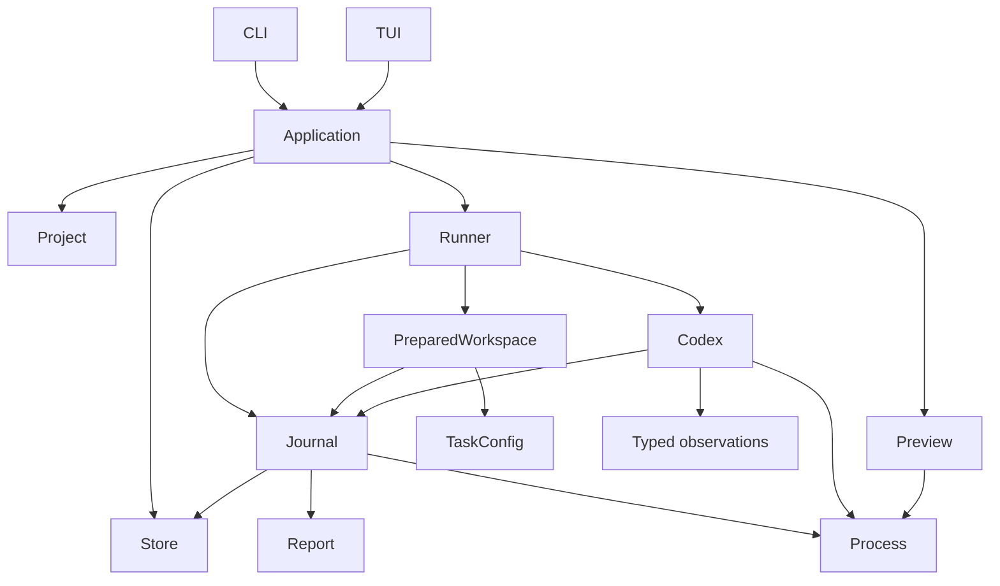

# Architecture assessment

The app must run local experiments, preserve measured evidence, and let a person review the result.
The CLI and terminal UI are two interfaces to the same application.

## Problems in the previous structure

| Problem                                                      | Effect                                                                                               | Change                                                                         |
| ------------------------------------------------------------ | ---------------------------------------------------------------------------------------------------- | ------------------------------------------------------------------------------ |
| `Store` handled task sources and saved runs.                 | Source validation and output ownership were coupled.                                                 | `Project` owns task discovery. `Store` owns saved runs.                        |
| Setup lived inside a large runner method.                    | Each task option added file and package rules to execution control.                                  | `PreparedWorkspace` owns copying, package setup, and baseline capture.         |
| CLI and TUI owned separate parts of run and preview control. | A lifecycle change could affect only one interface.                                                  | Both use `Application`.                                                        |
| `Report` parsed Codex JSON.                                  | Provider protocol changes affected the saved-data model.                                             | Codex decodes JSON into typed observations.                                    |
| State and timing changed at scattered call sites.            | Early failures could lose setup time. Successful process exit could be confused with completed work. | `Journal` owns measurements and writes. `Report` checks lifecycle transitions. |
| Preview readiness had separate blocking and polled paths.    | Startup and shutdown rules could differ by interface.                                                | One `Preview` owns the process and readiness state.                            |
| Internal modules exposed execution helpers as public API.    | Callers could bypass the application owner.                                                          | Execution modules are private.                                                 |

## Dependency direction



`toolchain.rs` resolves host executables. It does not choose a run, own a report, or start a
preview. Codex owns credentials and the isolated session. Private session files stay outside public
evidence.

## Run ownership

1. `Application` validates settings and obtains a task source from `Project`.
2. `Runner` resolves executables, takes the run lock, creates the report, and owns the worker.
3. `Journal` starts setup measurement.
4. `PreparedWorkspace` copies inputs, validates the saved snapshot, and copies the starter.
5. It applies `task.toml`, installs packages, formats setup files, and saves the baseline.
6. Codex creates a private session and checks login.
7. Codex executes the saved prompt. The process owner saves raw output. The decoder produces
   observations for the report. The journal saves measured progress.
8. The runner attempts trace capture and source inventory even when agent execution fails.
9. Verification runs only after the agent process and completion evidence pass.
10. The journal saves a terminal result. It preserves measurements on failure or cancellation.

The worker owns the storage lock until its work ends. Dropping its handle cancels and joins it. The
process owner terminates the child group. The session owner removes private per-run state.

## Lifecycle rules

```text
Preparing -> Running -> Verifying -> Ready
     |          |           |
     +----------+-----------+-----> Failed / Cancelled / Interrupted
```

`Ready` needs a completed agent turn, no provider failure, valid event records, an agent exit code
of zero, and verification with an exit code of zero. Cancellation takes precedence over a final
successful process result. Recovery changes active reports to `Interrupted`. Recovery leaves
completed results unchanged.

The serialized report is a versioned data record, not an executable run. Loading an old report does
not start processes or reconstruct an active worker. Report version 1 and existing field names
remain supported. Optional task settings remain backward compatible.

## Task configuration

`TaskConfig` parses and transforms in-memory data. It does not read files, install packages, or
start processes. `Project` loads source inputs. `PreparedWorkspace` loads the saved input snapshot
again, so execution uses the same task content that the run preserves.

Package versions and script permissions remain explicit in each task. Only the run copy changes.
Setup files are saved before agent execution. Their changes are not counted as agent edits.

## UI and review

The TUI owns selection, search, forms, scroll position, and display text. It calls the application
service for effects. Pure rendering uses memory buffers in tests.

`Application` owns one preview. Both interfaces use the same start, poll, open, and stop operations.
Polling does not open a browser. An interface requests that action after readiness. The preview owns
its process and run lock. Removal stops an owned preview before deleting the selected run.

## Verification boundaries

Automated tests stay in memory. They cover event decoding and reduction, report compatibility,
source comparisons, task settings, lifecycle rules, and rendering behavior. They do not create
files, start processes, install packages, or open browsers or editors.

File copying, package installation, credentials, process shutdown, and browser preview require
separate manual checks. Use external run storage. Preserve the reports for those checks.

## Deliberate limits

- One active worker remains sufficient. There is no job queue or async runtime.
- The app targets local Codex. There is no generic provider or plugin system.
- The UI still reloads saved reports. There is no event database or application message bus.
- The report schema stays flat for compatibility. Runtime ownership is separate from serialization.
- Configuration separation does not provide full host isolation.
- Desktop launch actions and host file operations cannot be proved by memory-only tests.

Extend the owner of a behavior when that behavior changes. Do not put new package rules in the CLI,
JSON decoding in report rendering, or child-process ownership in the TUI.
